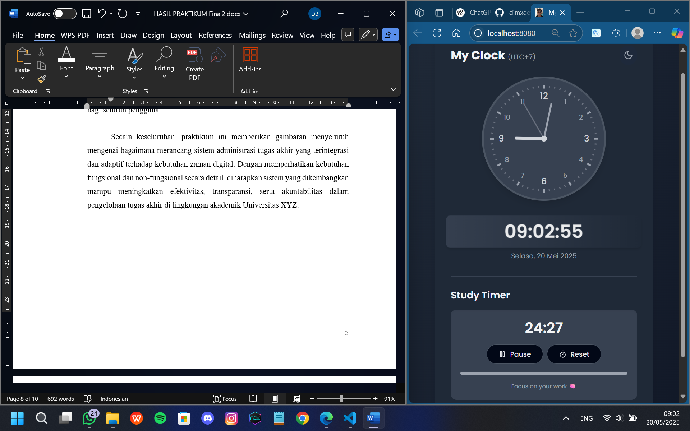

# 🕒 My Clock Bliss – Realtime Clock & Study Timer Web App

**My Clock Bliss** adalah aplikasi web interaktif berbasis **React + TypeScript** yang menampilkan:
- ⏰ Jam analog dan digital secara realtime berdasarkan waktu **Jakarta (WIB - UTC+7)**
- ⏳ Study Timer sederhana ala Pomodoro untuk membantu sesi belajar fokus
- 🎨 UI modern dengan tema abu-abu elegan dan animasi halus

> Dibuat untuk menemani kegiatan belajar agar lebih teratur dan menyenangkan 🎓

---

## 🔧 Teknologi yang Digunakan

- ⚛️ React
- 🟦 TypeScript
- 💨 Tailwind CSS
- 📦 Vite (untuk bundler modern dan cepat)

---

## 🖥️ Fitur Utama

### 🕰️ Jam Analog
- Dibuat dengan elemen SVG
- Jarum jam dengan animasi realtime
- Sinkron dengan waktu Jakarta (WIB)

### 💻 Jam Digital
- Update setiap detik
- Menampilkan waktu dan tanggal dalam format Indonesia

### ⏲️ Study Timer
- Dapat disesuaikan (1–60 menit)
- Tombol Start / Reset
- Progress bar animasi
- Bergaya Pomodoro (default 25 menit)

### 🎨 UI dan Tema
- Warna abu-abu lembut (grayscale) 
- Responsif untuk tampilan desktop & mobile
- Font bersahabat, cocok untuk suasana belajar

---

## 🛠️ Cara Menjalankan Secara Lokal

### 1. Clone Repository

```bash
git clone https://github.com/username/my-clock-bliss.git
cd my-clock-bliss
```

### 2. Install Dependencies

```bash
npm install
```

### 3. Jalankan Aplikasi

```bash
npm run dev
```

Setelah itu, buka browser dan akses:

```
http://localhost:5173
```

---

## 🖼️ Cuplikan Layar

### ⏲️ Study Timer Aktif




